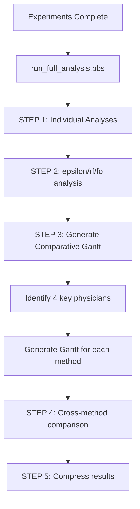

# Comparative Gantt Chart Generation - Design Document

## Overview

Gantt chart generation has been moved from individual experiment runs to the centralized post-processing analysis stage. This eliminates the major bottleneck that was causing experiments to exceed walltime limits.

## Problem Statement

### Previous Approach (Removed)
- **Location**: Inside `NSGA2OutputWriter.__init__` during experiment execution
- **Trigger**: Automatically for every solution exported (up to 7 per instance)
- **Impact**: 
  - 70+ Gantt charts per job (10 instances × 7 solutions)
  - ~1.5h overhead per instance
  - Total: 25h for 10 instances (exceeded 15h walltime )

### New Approach (Current)
- **Location**: Centralized in `run_full_analysis.pbs` post-processing stage
- **Trigger**: After all optimizations complete, once per instance
- **Impact**:
  - 16 Gantt charts per instance (4 physicians × 4 methods)
  - ~30-60 min for all instances in analysis job
  - Experiments now: ~1.1h per instance = 11h total (fits in 15h walltime ✅)

## Architecture

### Key Physicians Selection

For each instance, 4 physicians are identified for comparison:

1. **Most Available**: Physician with highest number of working days
2. **Least Available**: Physician with lowest working days (but > 0)
3. **Most Clinics**: Physician assigned to most distinct clinics
4. **Fewest Clinics**: Physician assigned to fewest clinics (among active)

**Important**: The same 4 physicians are used across ALL methods (epsilon, rf, fo, nsga2) to enable direct visual comparison.

### Selection Logic

```python
# Use first available method as reference (typically epsilon/exact)
reference_method = 'epsilon'
allocation = load_allocation(reference_method)

# Calculate per-physician metrics
for physician in allocation:
    working_days = count_distinct_dates(physician)
    distinct_clinics = count_distinct_clinics(physician)

# Select extremes
most_available = physician with max(working_days)
least_available = physician with min(working_days) where working_days > 0
most_clinics = physician with max(distinct_clinics)
fewest_clinics = physician with min(distinct_clinics) where working_days > 0
```

### Output Structure

```
data/output/run_dezembro/30_days/2022jan02_to_2022jan31/
├── epsilon/
│   └── analysis/
│       ├── gantt_comparative_most_available.png
│       ├── gantt_comparative_least_available.png
│       ├── gantt_comparative_most_clinics.png
│       └── gantt_comparative_fewest_clinics.png
├── rf/
│   └── analysis/
│       ├── gantt_comparative_most_available.png
│       ├── gantt_comparative_least_available.png
│       ├── gantt_comparative_most_clinics.png
│       └── gantt_comparative_fewest_clinics.png
├── fo/
│   └── analysis/
│       └── (same 4 Gantt charts)
└── nsga2/
    └── analysis/
        └── (same 4 Gantt charts)
```

**Naming Convention**: `gantt_comparative_{category}.png`
- Makes it clear these are for cross-method comparison
- Easy to find the same physician across different methods
- Distinguishes from any legacy single-method Gantt charts

## Implementation

### Files Modified

1. **`engine/data_pipeline/output_writer/nsga2_output_writer.py`**
   - Removed `write_metrics()` method
   - Removed `write_gantt_charts()` method
   - Removed analytics imports (MetricsCollector, GanttGenerator)
   - Added comment: analytics now in post-processing

2. **`analytics/analysis/generate_comparative_gantt.py`** (NEW)
   - Identifies 4 key physicians per instance
   - Generates comparative Gantt charts across all methods
   - Saves to each method's `analysis/` directory

3. **`cluster/pbs/run_full_analysis.pbs`**
   - Added STEP 3: Generate Comparative Gantt Charts
   - Increased walltime: 4h → 8h
   - Calls `generate_comparative_gantt.py` for each instance

4. **`cluster/submit_run_1.sh`**
   - Updated analysis job walltime: 4h → 8h

### Workflow



## Usage

### Automatic (Cluster)

Gantt charts are generated automatically after experiments complete:

```bash
# Submit experiments (no Gantt generation during this stage)
bash cluster/submit_run_1.sh

# Gantt charts generated in dependent analysis job
# Check progress: qstat -u $USER
# View output: logs/euler/*/PhysAlloc_analysis_*.log
```

### Manual (Local Testing)

Generate Gantt charts for a specific instance:

```bash
python3 analytics/analysis/generate_comparative_gantt.py \
    --instance_dir data/output/run_dezembro/30_days/2022jan02_to_2022jan31 \
    --methods epsilon rf fo nsga2
```

## Benefits

### Performance
- **Experiments**: 2.5h → 1.1h per instance (-56%)
- **Total 10 instances**: 25h → 11h (now fits in 15h walltime)
- **Analysis job**: Can take 8h for all instances (non-critical if exceeds)

### Quality
- **Standardized**: Same physicians compared across all methods
- **Fair**: No cherry-picking - automated selection
- **Comprehensive**: 4 different perspectives (availability, clinic diversity)

### Maintainability
- **Separation**: Optimization and visualization are decoupled
- **Reusable**: Can regenerate Gantt charts without re-running experiments
- **Flexible**: Easy to add new physician selection criteria

## Limitations and Future Work

### Current Limitations
1. Uses first available method (typically epsilon) as reference
   - If epsilon fails but other methods succeed, might miss some physicians
   - **Mitigation**: Falls back to next available method automatically

2. Fixed to 4 physicians
   - May not capture all interesting cases
   - **Future**: Add option for N physicians or custom selection

3. NSGA-II uses first Pareto solution (1_min_unmet)
   - Other Pareto solutions not visualized
   - **Future**: Add option to generate Gantt for all Pareto solutions

### Potential Enhancements
- [ ] Add metrics-based selection (e.g., physician with most violations)
- [ ] Generate multi-physician comparison plots (side-by-side)
- [ ] Add PDF report generation with all Gantt charts
- [ ] Support custom physician IDs via config file
- [ ] Parallel Gantt generation for faster processing

## Verification

Check logs to confirm Gantt generation:

```bash
# Analysis job log
cat logs/euler/*/PhysAlloc_analysis_30.log | grep -A 20 "STEP 3: Generating comparative"

# Should show:
# STEP 3: Generating comparative Gantt charts
# ==========================================
# Instance: 2022jan02_to_2022jan31
# Found 4 method(s): ['epsilon', 'rf', 'fo', 'nsga2']
# 
# Identifying key physicians using epsilon...
#   Most available: 12345 (28 days, 3 clinics)
#   Least available: 67890 (5 days, 1 clinics)
#   ...
# Charts generated: 16/16
```

Check generated files:

```bash
# List all comparative Gantt charts
find data/output/run_dezembro/30_days -name "gantt_comparative_*.png"

# Should find 4 charts per method per instance
# Example: 4 charts × 4 methods × 10 instances = 160 total
```

## Impact on Other Components

### Not Affected
- **Gurobi/MIP methods**: Never generated Gantt automatically
- **NSGA-II optimization**: Only CSVs exported, analysis removed
- **Downstream analytics**: All CSV files still generated as before

### Requires Update
- **Papers/Presentations**: Use `gantt_comparative_*.png` instead of method-specific Gantt
- **Custom analysis scripts**: Update paths to look in `analysis/` directory

## Timeline

- **Before**: Gantt generated during experiment (slow, blocking)
- **After**: Gantt generated in analysis job (fast, parallel, non-blocking)

```
BEFORE:
Experiment 1: [Optimization 1h] [Analysis+Gantt 1.5h] = 2.5h
Experiment 2: [Optimization 1h] [Analysis+Gantt 1.5h] = 2.5h
...
Experiment 10: [Optimization 1h] [Analysis+Gantt 1.5h] = 2.5h
Total: 25h  (exceeds 15h walltime)

AFTER:
Experiment 1-10: [Optimization 1h each] = 11h ✅
Analysis Job: [Generate Gantt for all] = 2-3h ✅
Total: 14h fits in 15h walltime
```

## Troubleshooting

### Problem: Gantt charts not generated

**Check**:
1. Analysis job completed? `qstat -u $USER`
2. Log file: `logs/euler/*/PhysAlloc_analysis_*.log`
3. Allocation files exist? `ls data/output/*/solution/allocation.csv`

**Fix**:
- Rerun manually: `python3 analytics/analysis/generate_comparative_gantt.py ...`

### Problem: Wrong physicians selected

**Check**:
- Which method used as reference? (printed in log)
- Reference method has complete allocation data?

**Fix**:
- Manually specify reference method in script (future enhancement)
- Regenerate with different method order: `--methods rf epsilon fo nsga2`

### Problem: Some methods missing Gantt

**Check**:
- Method directory exists? `ls data/output/*/nsga2/solution/`
- allocation.csv exists in solution directory?

**Fix**:
- Individual method likely failed during optimization
- Check method-specific logs
- Generate Gantt only for successful methods
